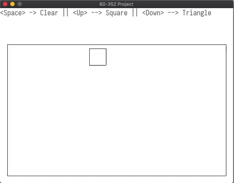

# 
60-352 Project

By: Majid Joseph, Mostapha Rammo, Steven Bodnar, Abdul Abu Libda

## Overview
Dr. Kent had given us permission to use whatever tool we deemed to be necessary to complete the project. We decided that we would use OpenGL to accomplish certain aspects of the project, mainly to do with 3D operations, and SDL2 to handle some of the 2D operations. You may be thinking why not just use OpenGL for the entire project? We decided not to do this because we had already acquired a reasonable amount of experience in SDL2 and we wanted to incorporate it in someway. You will see two separate program submissions, one that is SDL2, and one that is OpenGL.

## Submission 1: SDL2
We used `STD_PollEvent` to listen for keyboard clicks and a canvas exit click. By doing this, we were able to display the display menu on the actual canvas, making it more elegant. A clipping window will be drawn under the text.

#### Operations

 - Close Button
	 - Pressing the close button will exit the program
-	Up Arrow Key
	-	Will generate a square
	-	Will have a random start point
	-	Will have a random side length
- Down Arrow Key
	- Will generate a triangle
	- Will have a random start point
	- will have random side length
- Space Key
	- will clear the clipping window

All Shapes that are drawn to the screen will be clipped against the clipping window using the [Liang–Barsky algorithm](https://en.wikipedia.org/wiki/Liang%E2%80%93Barsky_algorithm).

